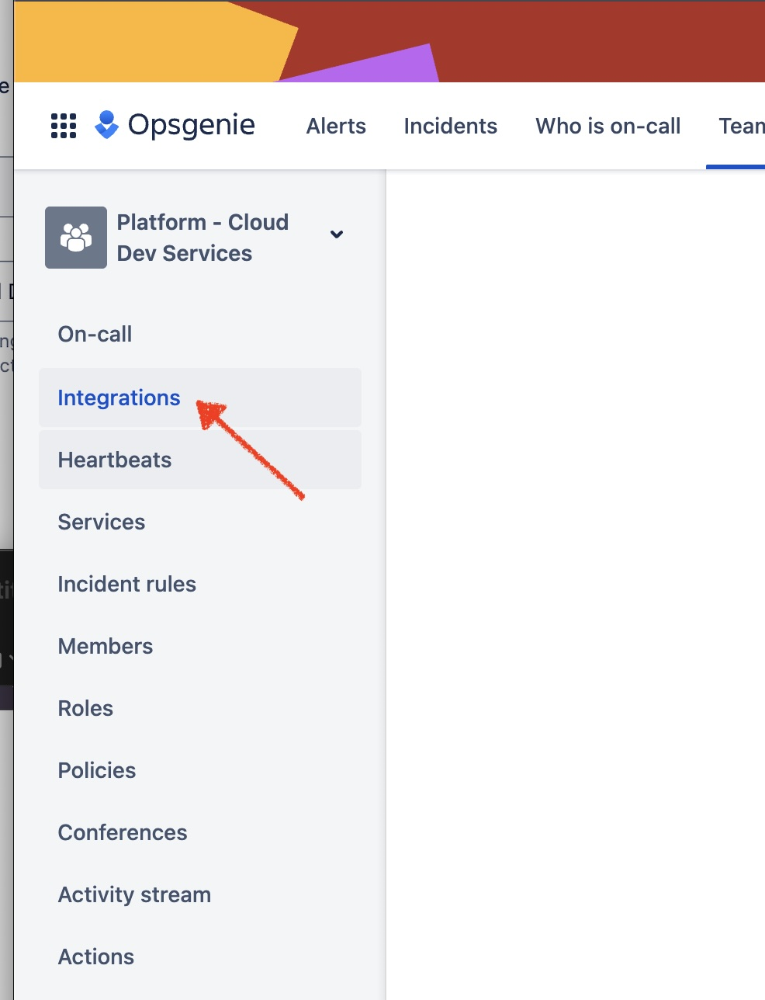
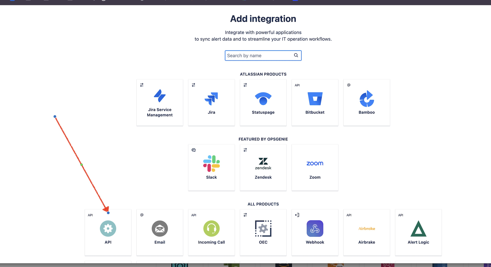
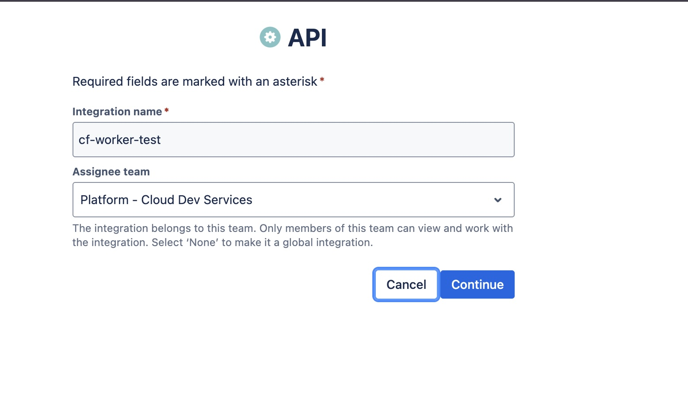
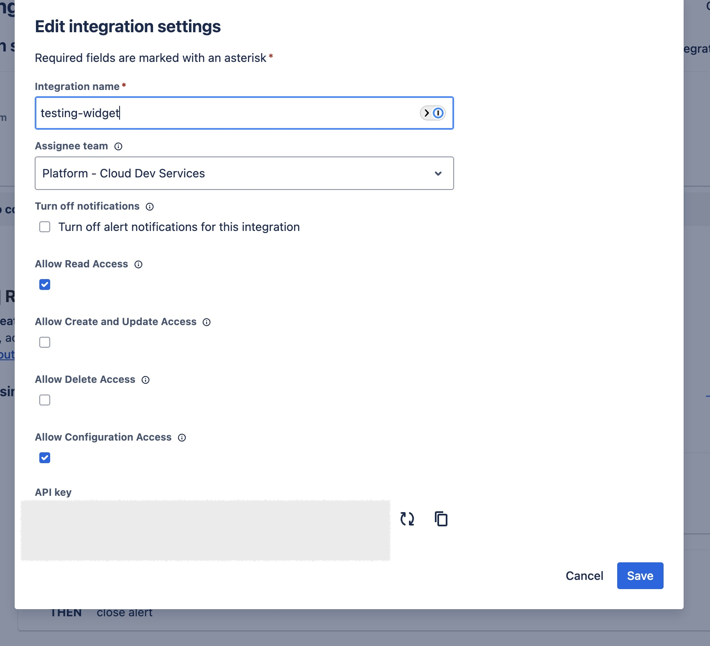

# Cloudflare worker for OpsGeniue team on-call schedule

## Purpose

returns the current CDS on call schedule. I currently use this for [Wigify](https://github.com/wigify/wigify) to show my teams on-call.  I used Cloudflare workers was used to mitigate COR's issues.

### Getting Started

#### Getting OpsGenie API Token

Requires a team integration within opsGenie with `read configuration` scope









#### Result

```json
{
  "Cloud Eng - Cloud Dev_schedule": {
    "current": {
      "name": "Homer Simpson",
      "shiftEnds": "2026-02-26T02:00:00Z",
      "hoursLeft": 6.98
    },
    "next": {
      "name": "Bart Simpson",
      "shiftStarts": "2026-02-26T02:00:00Z",
      "shiftDurationHours": 2
    }
  }
}
```

### Development

How to deploy using Wrangler

#### Deploying

```bash
npx wrangler deploy
```

##### Logging

```bash
npx wrangler tail
```
